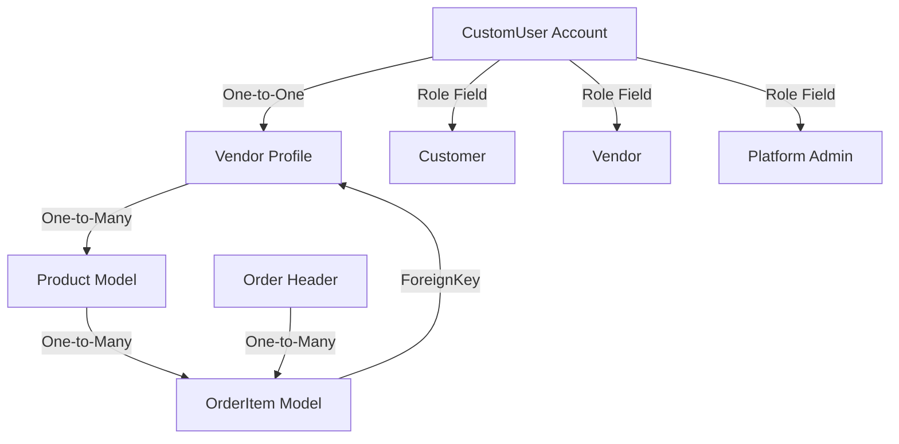

# A.K.D SaaS Multi-Merchant Marketplace Implementation Guide

This guide details the technical architecture, database schema, onboarding pipelines, and operational controls implemented to scale **A.K.D Fashion and Design** from a single-vendor store into a fully scalable SaaS multi-merchant marketplace platform.

---

## 1. Architectural Overview

The marketplace follows a decoupled hub-and-spoke relationship where third-party merchants manage individual shop profiles, products, and order split items, while A.K.D remains the platform orchestrator (charging commission rates on individual transactions).



---

## 2. Database Models & Schema Specifications

### A. CustomUser Account Extension (`users/models.py`)
A custom user can be assigned one of three granular platform roles:
*   `customer` (Default): Can shop, place orders, and like items.
*   `vendor`: Represents business partners who own shops.
*   `admin`: Platform administrators.

### B. Vendor Profile Model (`users/models.py`)
Manages custom merchant shop settings, payout identifiers, and verification status:
*   `owner` (OneToOneField to `CustomUser`): Linking a unique user profile to a storefront.
*   `shop_name` (CharField, Unique): Visible marketplace shop name.
*   `slug` (SlugField, Unique): Auto-generated unique URL segment (e.g., `akd-luxury-wear`).
*   `is_active` (BooleanField, Default `False`): Platform control allowing admins to approve storefronts before they become visible to customers.
*   `commission_percentage` (DecimalField, Default `10.00%`): Granular transaction fees dynamically retained by the platform.
*   `stripe_connect_id` (CharField, Blank): Payout merchant ID for Stripe split checkout integration.

### C. Product Vendor Binding (`products/models.py`)
Each listed item is bound to its respective vendor:
*   `vendor` (ForeignKey to `users.Vendor`): Links each item to its shop owner. If null, the product is treated as a core platform offering.

### D. Sub-Order Logistics Mapping (`orders/models.py`)
To isolate fulfillment pipelines, order details are captured at the item level:
*   `vendor` (ForeignKey to `users.Vendor`): Automatically links sold items to the vendor for earnings computation.
*   `fulfillment_status` (CharField): Independent item-level states (`pending`, `shipped`, `delivered`, `cancelled`) ensuring merchant operations remain isolated.

---

## 3. Onboarding & Registration Workflow

A.K.D features a premium, fully customized **Neumorphic Soft UI Onboarding Interface** built to guide merchants through registration smoothly.

### A. Atomic Registration Form (`users/forms.py:VendorCreationForm`)
The custom form processes registration atomically, ensuring database integrity:
1.  Validates and creates a secure `CustomUser` credentials account.
2.  Applies the `'vendor'` role flag.
3.  Slugifies the verified shop name.
4.  Creates the accompanying `Vendor` profile in a locked, pending state.

### B. Accessing the Merchant Portal
1.  **Merchant Registration Endpoint**: `/auth/register-vendor/`
2.  **Merchant Control Panel**: Dynamically rendered as a dedicated **🏪 Merchant Dashboard** tab inside the user Profile portal (`/auth/profile/`) once authenticated as a vendor.

---

## 4. Execution & Migrations Guide

The multi-merchant database evolution has been packaged into 3 clean, manual database migrations that execute linearly on deployment:

1.  **Users App Migration (`0003_customuser_role_vendor.py`)**: Adds role enum column to accounts table and generates the new vendor profiles table.
2.  **Products App Migration (`0005_product_vendor.py`)**: Establishes cross-app foreign key relationships to link listed products to vendor stores.
3.  **Orders App Migration (`0005_orderitem_vendor_orderitem_fulfillment_status.py`)**: Integrates vendor tracking and independent shipping statuses on individual line items.

### Running Migrations Manually
When deploying to staging or production, run the following Django CLI commands:
```powershell
python manage.py makemigrations
python manage.py migrate
```

---

## 5. Future Platform Roadmap

To scale A.K.D further, follow these integration steps:
1.  **Stripe Connect Express**: Integrate Stripe Connect split charges so customer payments automatically separate, paying the vendor minus platform commissions dynamically.
2.  **Isolated Merchant Inventory Panels**: Implement custom dashboard forms so merchants can add/edit products directly from their profile tab without requiring admin portal access.
